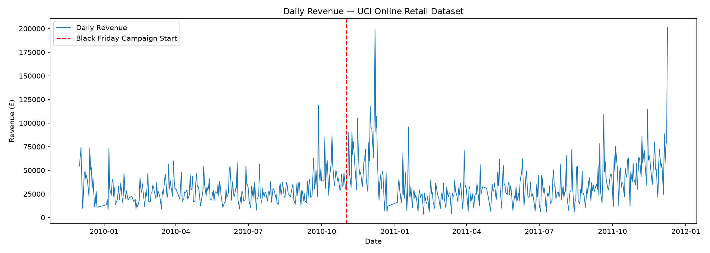
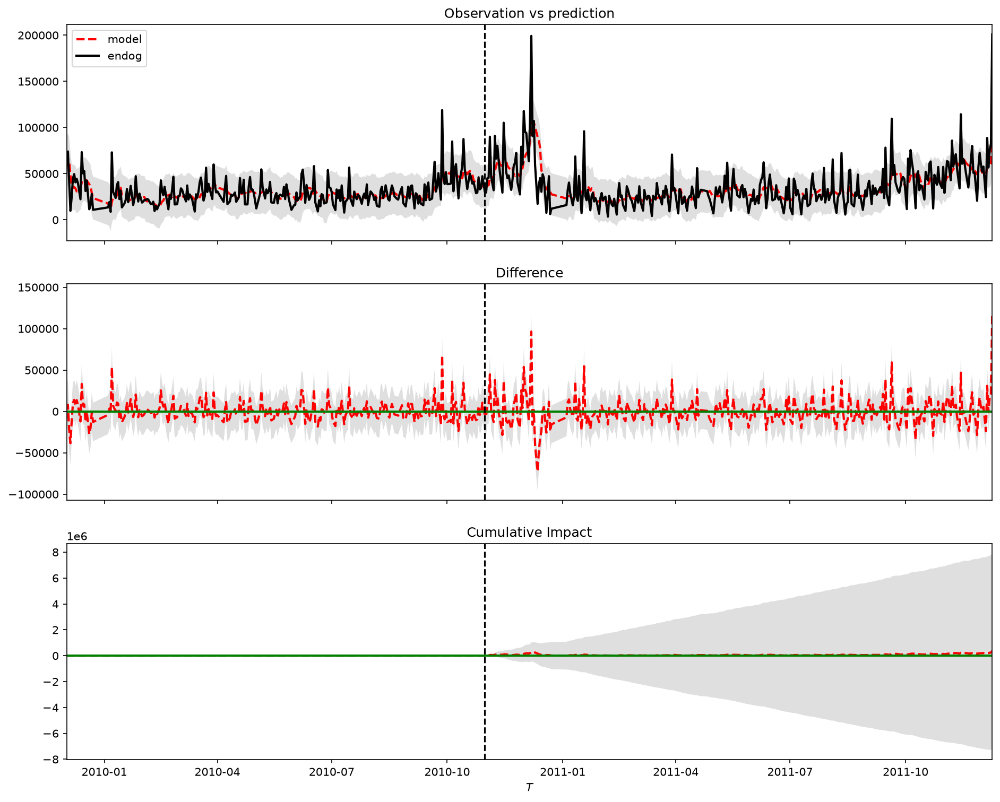
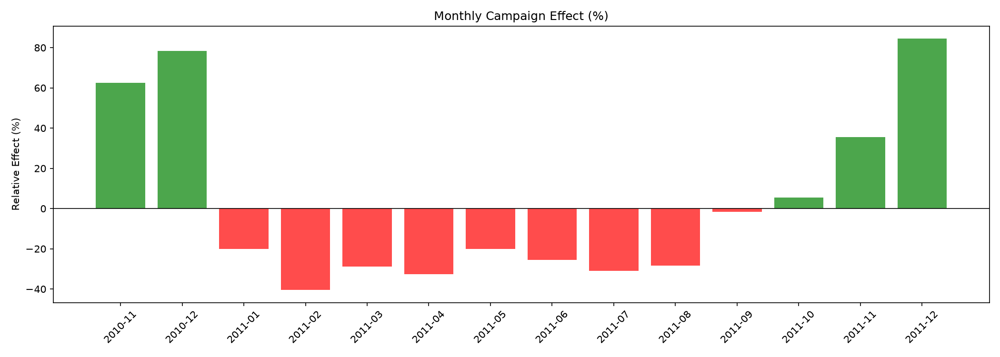
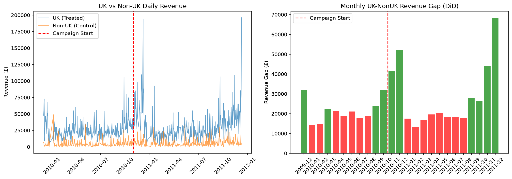

# E-commerce Campaign Causal Impact Analysis
**Did the Black Friday campaign actually drive revenue — or was it just seasonal trends?**

## Overview
Simple before-and-after comparisons can be misleading.  
This project uses **Causal Impact analysis** to isolate the true effect of a Black Friday campaign on daily revenue, controlling for underlying trends and seasonality.

## Dataset
- **Source**: [UCI Online Retail II Dataset](https://www.kaggle.com/datasets/mashlyn/online-retail-ii-uci)
- **Period**: December 2009 – December 2011
- **Size**: 1,067,371 transactions
- **Campaign Event**: Black Friday campaign starting 2010-11-01

## Key Findings

### Method 1: CausalImpact (Bayesian Structural Time Series)
| Metric | Value |
|--------|-------|
| Pre-campaign daily avg revenue | £30,757 |
| Post-campaign daily avg revenue | £37,993 |
| Naive before-after comparison | +23.5% |
| **Causal Impact estimate** | **+3.0%** |
| P-value | 0.1% |
| Probability of causal effect | 99.9% |

### Method 2: Difference-in-Differences (DiD)
| Metric | Value |
|--------|-------|
| Treatment group | UK customers |
| Control group | Non-UK customers |
| **DiD estimate (daily)** | **+£4,936** |
| P-value | 0.37% |
| Statistical significance | ✅ Significant (p<0.05) |

### Robustness Check
> Both methods confirm the campaign had a **statistically significant positive effect** on revenue.  
> The naive before-after comparison (+23.5%) overstated the true effect — most of the increase was driven by seasonal trends, not the campaign itself.

## Why This Matters
Without causal inference, marketers risk:
- **Overattributing** revenue to campaigns that merely coincided with seasonal peaks
- **Misallocating** budget based on inflated ROI estimates

## Methodology
1. **Data preprocessing** — removed returns, filtered valid transactions, aggregated daily revenue
2. **Exploratory analysis** — identified campaign window and seasonal patterns
3. **Causal Impact model** — Bayesian structural time series (via `causalimpact`)
   - Pre-period: 2009-12-01 ~ 2010-10-31
   - Post-period: 2010-11-01 ~ 2011-12-09
   - Covariate: 7-day moving average of revenue

## Results

## Limitations
- Single covariate (7-day MA) may not fully capture external confounders
- Wide confidence intervals reflect high day-to-day revenue volatility
- Linear trend assumption may underfit complex seasonal patterns
- Results are based on a simulated campaign event; real campaign metadata was not available

## Tech Stack
- Python 3.12
- pandas, numpy, matplotlib
- causalimpact, pymc

## Next Steps
- Add Difference-in-Differences (DiD) as a robustness check
- Incorporate external covariates (e.g., holiday calendar, promotions)
- Apply to real-world A/B test data
